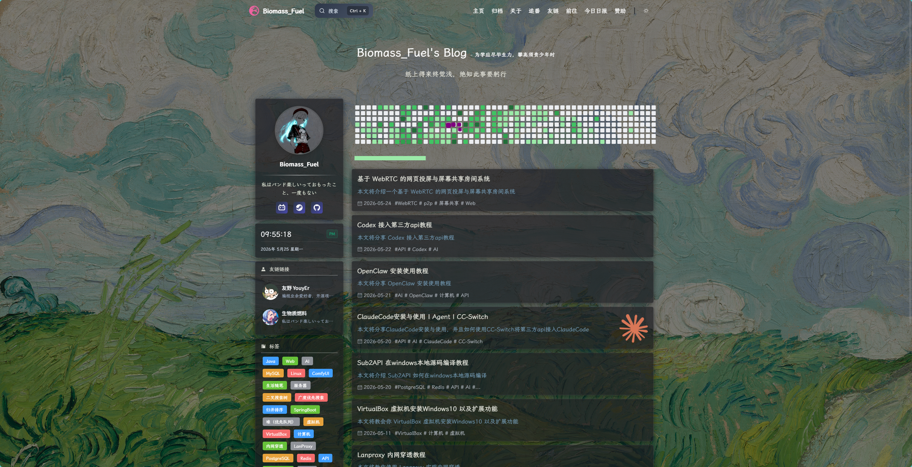
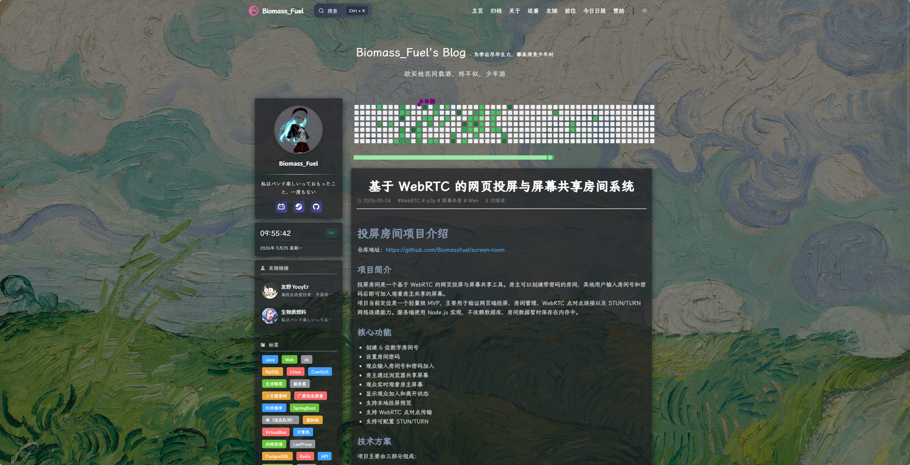
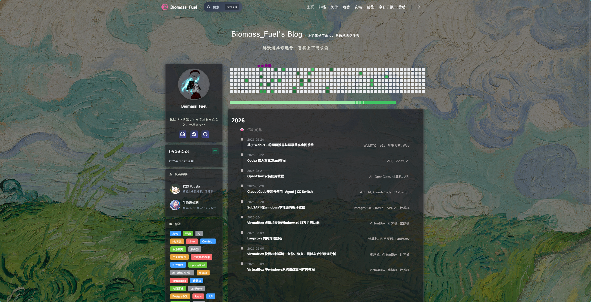
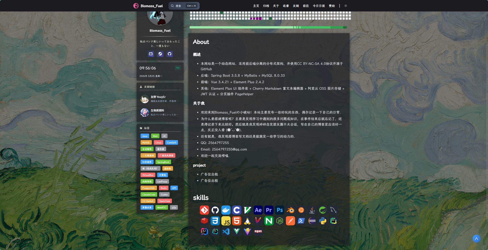
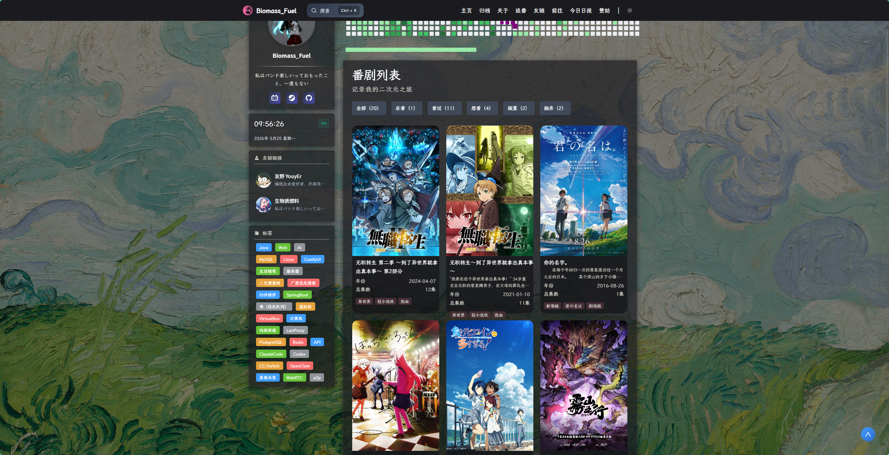
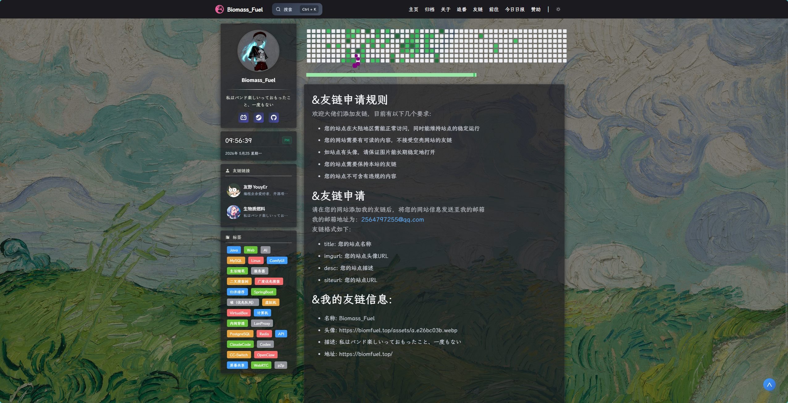
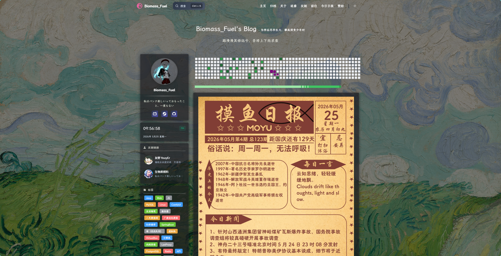
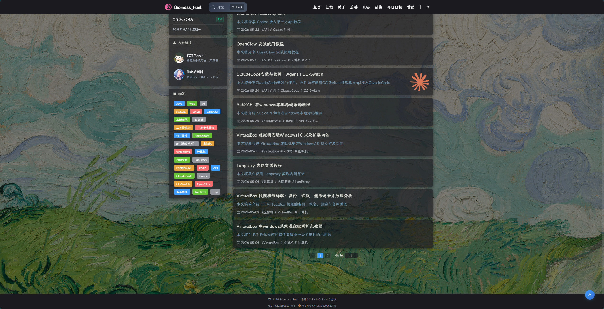
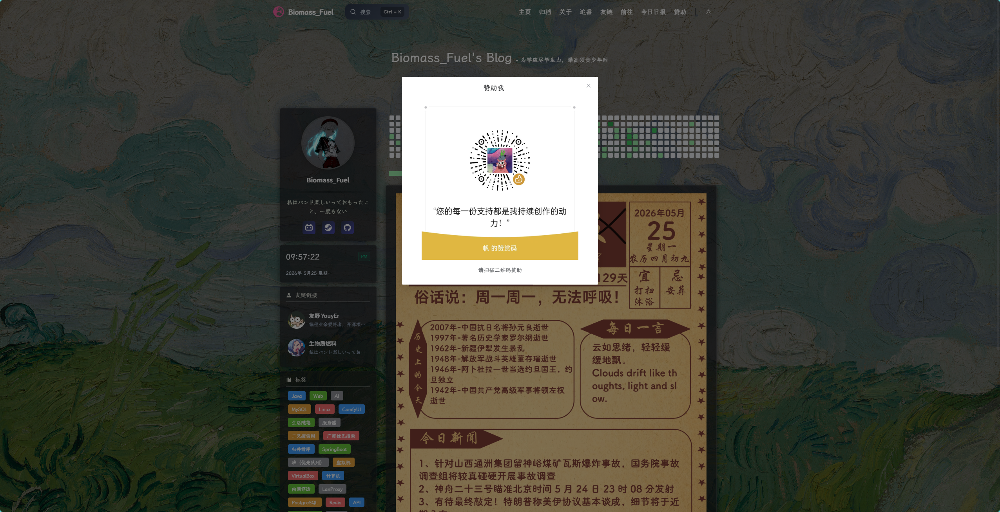

# fuelink-blog

`fuelink-blog` 是一个前后端分离的个人博客系统，包含博客前台、后台管理端和 Spring Boot 后端服务。项目偏向个人站点长期维护场景，支持文章发布、标签归档、友链展示、追番记录、今日日报和后台内容管理。

在线预览：[https://biomfuel.top/](https://biomfuel.top/)

## 界面预览

### 博客首页



### 文章阅读



### 归档与关于

| 文章归档 | 关于页面 |
| --- | --- |
|  |  |

### 追番与友链

| 追番列表 | 友链申请 |
| --- | --- |
|  |  |

### 今日日报



<details>
<summary>更多界面截图</summary>

| 页脚信息 | 赞助弹窗 |
| --- | --- |
|  |  |

</details>

## 功能概览

- 博客前台：文章列表、文章详情、归档时间线、标签展示、友链、关于页、追番页、今日日报展示。
- 后台管理：登录鉴权、文章管理、标签管理、友链管理、每日一句和基础内容维护。
- 后端服务：MySQL 数据访问、JWT 鉴权、分页查询、Argon2 密码校验、文件上传能力。
- 站点配置：前台展示信息集中维护，便于替换站点名、作者信息、备案号、社交链接和外部接口。

## 技术栈

| 模块 | 技术 |
| --- | --- |
| 后端 | Java 17、Spring Boot 3.5、MyBatis、MySQL、PageHelper、JWT、Argon2、Aliyun OSS SDK |
| 博客前台 | Vue 3、Vite、Vue Router、Element Plus、Axios、Cherry Markdown、ECharts、Mermaid |
| 后台管理端 | Vue 3、Vite、Vue Router、Element Plus、Axios、Cherry Markdown、wangEditor |

## 项目结构

```text
.
├── Blogback/          # Spring Boot 后端服务
├── BlogFront/         # Vue 3 后台管理端
├── BlogFront-end/     # Vue 3 博客前台
├── docs/screenshots/  # README 效果图
├── blog.sql           # 数据库初始化脚本
└── README.md
```

## 本地运行

### 1. 准备环境

- JDK 17+
- Node.js 18+
- MySQL 8+

### 2. 初始化数据库

1. 创建 MySQL 数据库。
2. 导入根目录的 `blog.sql`。
3. `blog.sql` 只保留建表语句，不包含默认账号或测试数据。

### 3. 配置后端

后端配置文件位于 `Blogback/src/main/resources/application.yml`。仓库里的版本保留了默认的 MySQL JDBC 地址和 JWT 过期时间，你只需要把占位符改成自己的值。

需要填写的配置：

| 配置项 | 说明 |
| --- | --- |
| `spring.datasource.username` | MySQL 用户名 |
| `spring.datasource.password` | MySQL 密码 |
| `blog.jwt.admin-secret-key` | 后台 JWT 签名密钥 |
| `blog.alioss.access-key-id` | 阿里云 AccessKey ID |
| `blog.alioss.access-key-secret` | 阿里云 AccessKey Secret |
| `blog.alioss.bucket-name` | OSS Bucket 名称 |
| `blog.alioss.public-base-url` | OSS 公网访问基础地址 |

通常不需要改的默认项：

| 配置项 | 默认值 |
| --- | --- |
| `spring.datasource.url` | `jdbc:mysql://localhost:3306/blog?useSSL=false&useUnicode=true&characterEncoding=utf-8&serverTimezone=Asia/Shanghai` |
| `blog.jwt.admin-ttl` | `7200000` |
| `blog.jwt.admin-token-name` | `token` |
| `blog.alioss.endpoint` | `oss-cn-beijing.aliyuncs.com` |

### 4. 初始化管理员账号

首次启动前，可以在 `application.yml` 中临时开启管理员初始化：

```yaml
blog:
  admin-initializer:
    enabled: true
    id: 1
    username: your_admin_username
    password: your_admin_password
```

启动后程序会自动对密码做 Argon2 加密并写入 `users` 表。如果账号已存在，会跳过创建。初始化成功后，请把 `enabled` 改回 `false`，避免后续误操作。

### 5. 配置前端展示信息

博客前台的站点名、作者名、联系方式、社交链接、友链申请信息、备案号、外部接口地址集中在：

```text
BlogFront-end/src/config/siteConfig.js
```

后台管理端首页的默认头像、每日一句接口和头像上传地址集中在：

```text
BlogFront/src/config/adminConfig.js
```

### 6. 启动服务

后端：

```powershell
cd Blogback
.\mvnw.cmd spring-boot:run
```

博客前台：

```powershell
cd BlogFront-end
npm install
npm run dev
```

后台管理端：

```powershell
cd BlogFront
npm install
npm run dev
```

默认情况下，后端服务运行在 `http://localhost:8080`，博客前台运行在 `http://localhost:9090`，前端接口通过 `/api` 代理到后端服务。

## 常用命令

```powershell
# 后端测试
cd Blogback
.\mvnw.cmd test

# 博客前台构建
cd BlogFront-end
npm run build

# 后台管理端构建
cd BlogFront
npm run build
```

## 今日日报说明

项目中的“今日日报”页面使用了第三方公开 API 生成的日报图片。感谢相关接口和内容提供者带来的灵感与便利。

该功能仅用于个人学习、展示和非商业用途。如果其中的图片、文字或数据涉及版权、署名、来源标注等问题，请联系站点维护者处理；确认后会及时删除、替换或补充说明。

## 后续计划

- 增加本地文件存储模式，将文章图片、头像等上传文件保存到服务器本地目录或挂载磁盘中，减少对 OSS 和 CDN 的依赖。
- 将文件访问地址统一由后端生成，前端只保存资源路径，方便在本地存储、OSS 或其他对象存储之间切换。
- 后台管理端增加上传配置说明和文件管理能力，便于查看、替换和清理已上传资源。
- 保留 OSS 作为可选部署方案，但不作为项目运行的必要依赖。
- 继续完善文章、标签、关于页和友链等内容管理体验，让个人博客更适合长期维护。
